Drove up to Point Reyes for a day trip today.

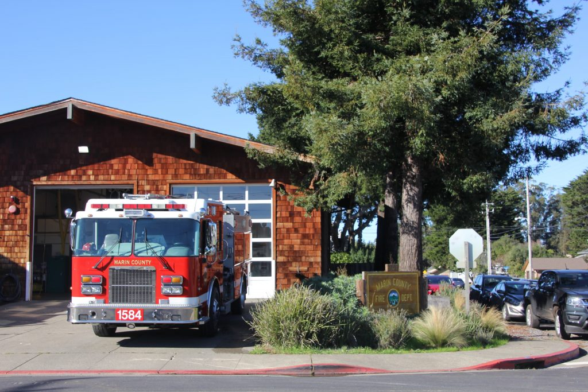
    
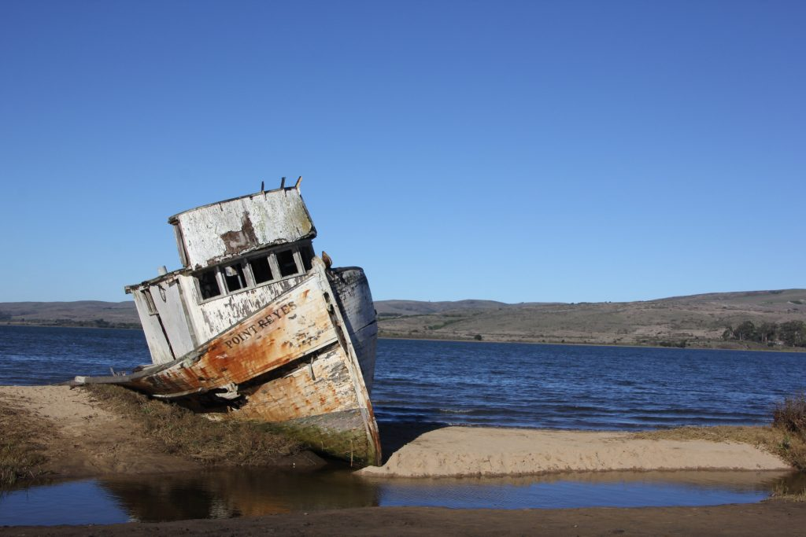
    
    [Point Reyes Shipwreck](https://www.google.com/maps/place/Point+Reyes+Shipwrecks/@38.0999276,-122.8508772,15.62z/data=!4m5!3m4!1s0x8085cf7f2781f937:0xbca09f2d41001b99!8m2!3d38.0978634!4d-122.850776)
    

Lunch at Cowgirl Creamery. Got a fresh mozzarella, salami, arugula sandwich with olive tapenade. Forgot to take a picture! Here are some shots inside the creamery.

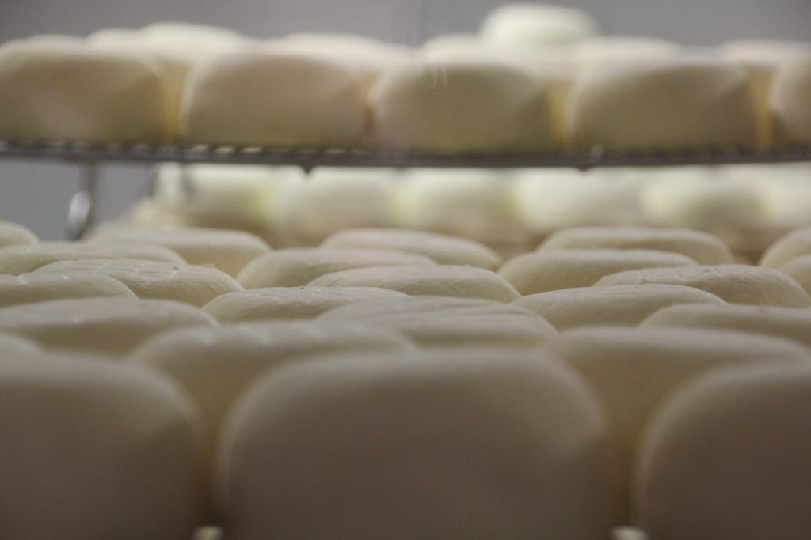
    
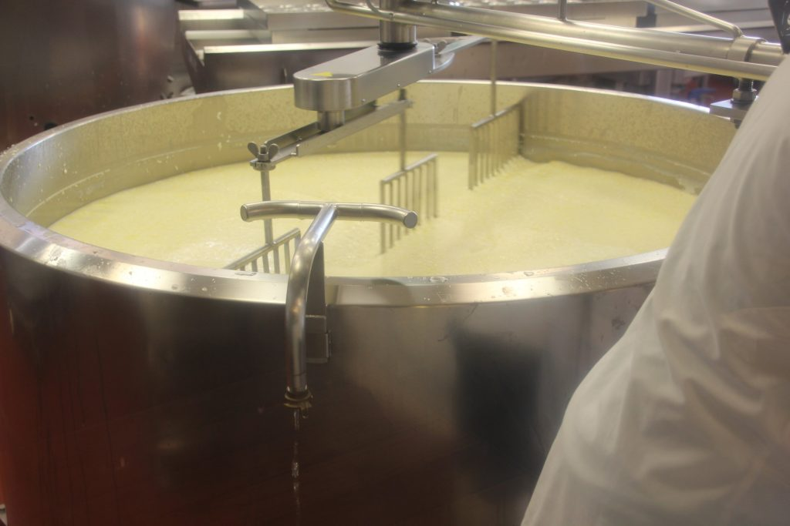
    

Drove up after lunch to the Tomales Point Trailhead. The trailhead begins at Pierce Point Ranch. The ranch produced butter and other dairy products during the late 1800s.

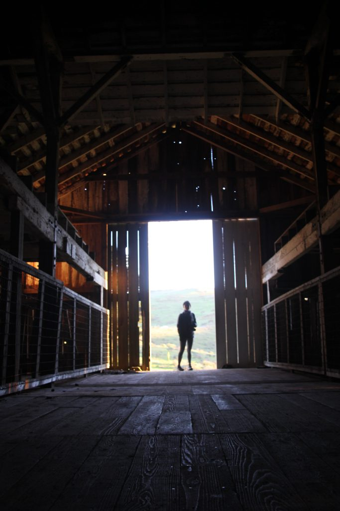

Inside the barn

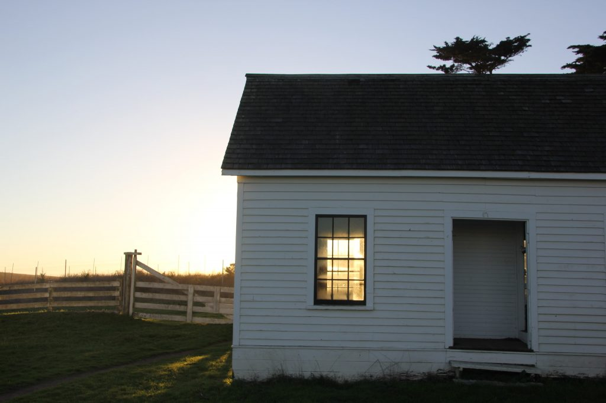

Old lodging for the workers

Here are some shots on the trail.

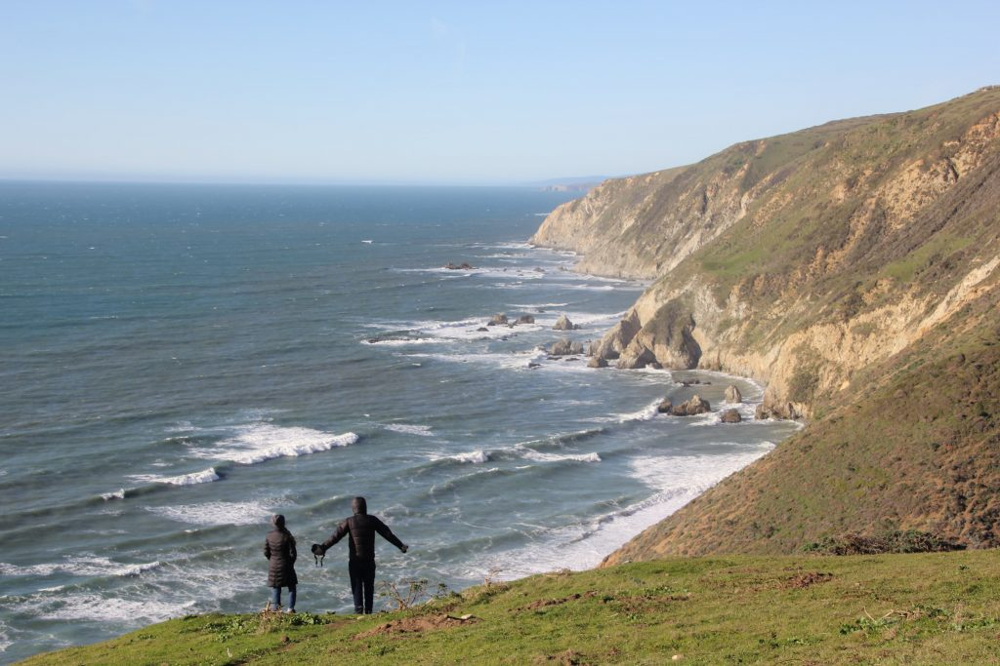

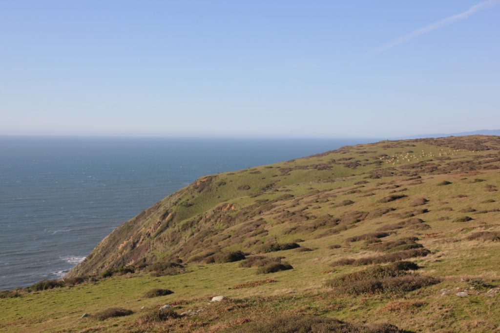

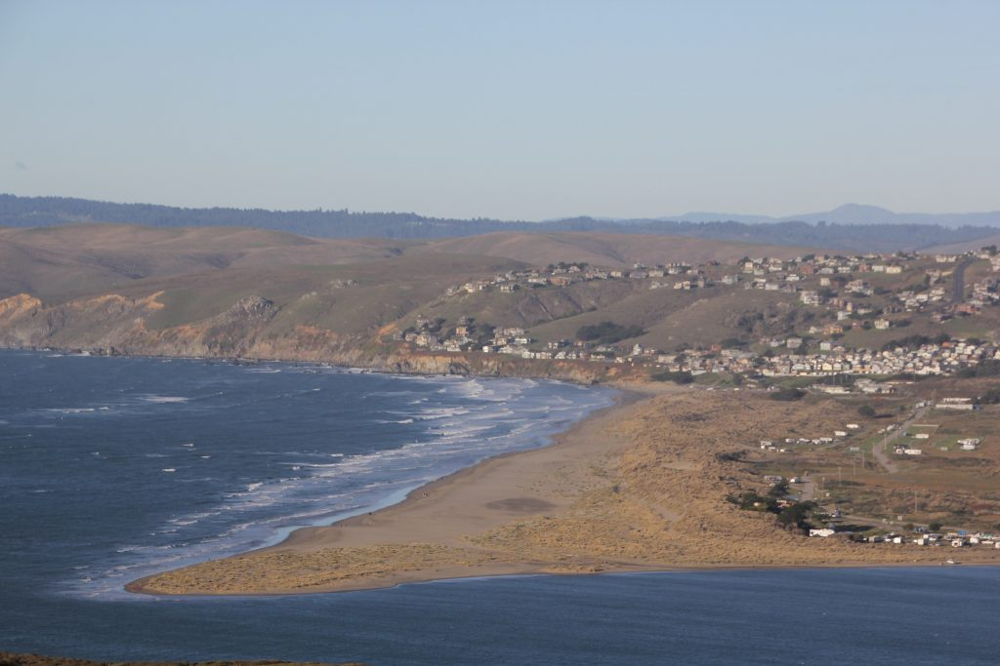

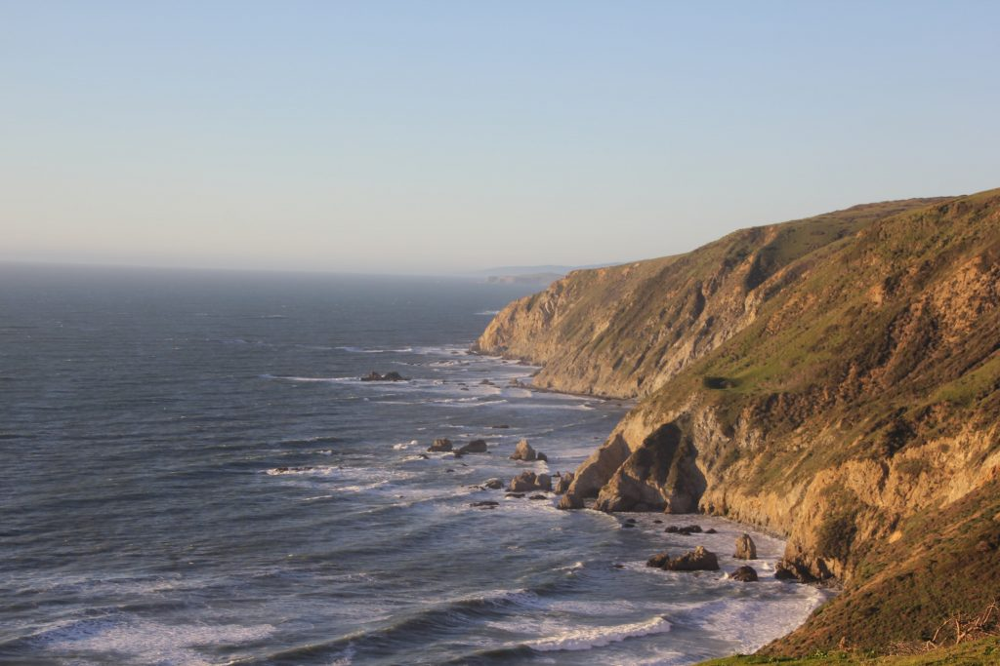

The trail had a good amount of wildlife and is known for its elk. We were lucky to see them from a safe distance on the trail!

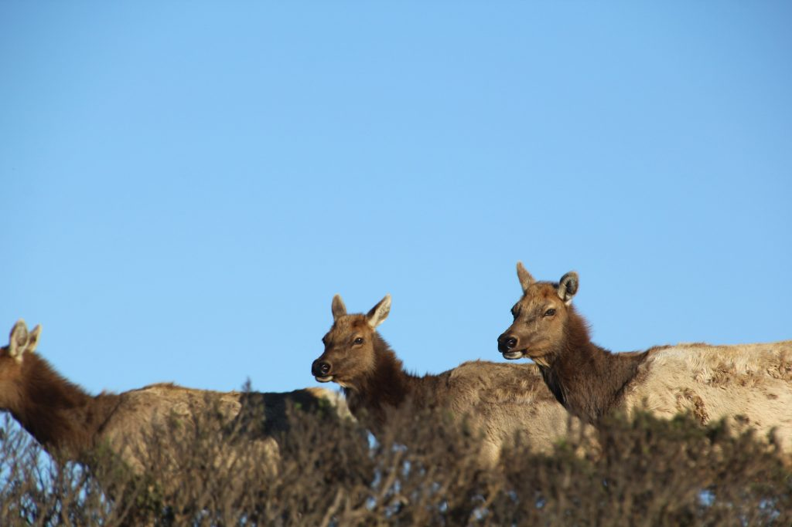

Hey there elk!

The drive up to the trail goes through these beautiful rolling green hills. Some parts were dotted with bright yellow flowers as far as you could see. We were lucky to catch a beautiful California sunset driving back through the hills. Would highly recommend.
