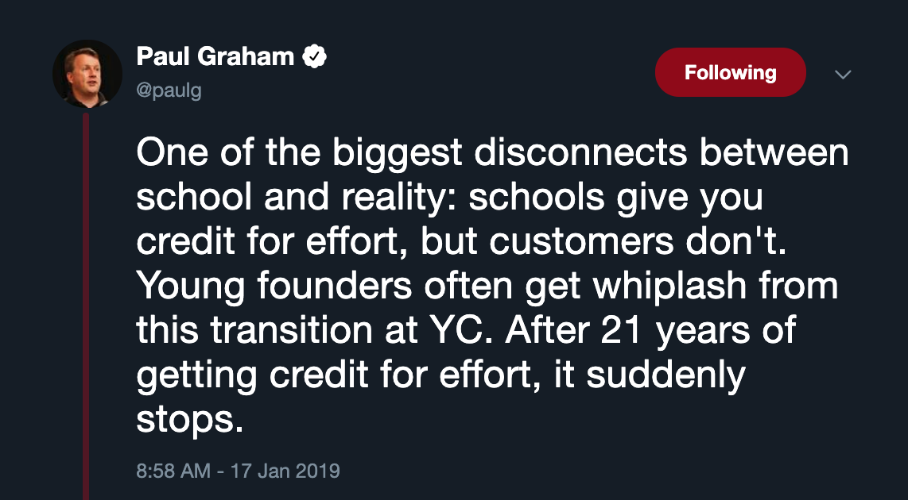

After school, effort and results don't necessarily correlate. For many things, results are binary. Either you succeed or you don't. One smart, well executed move can have outsized returns. If the same were true in school, that would be like writing one excellent paper and graduating.

The big mindset shift is to get comfortable with failure. The world is complex and no one knows what is going to work. The best thing you can do is to keep iterating until something sticks. Then double down on what works. Failing is a natural part of this process. It provides you new information to guide the next experiment. In school, failure comes with significant consequences. Failing means repeating a class, delaying graduation or lowering your GPA. The difference in life is that there is no transcript and failures are forgotten in time. While the goal is never to reach failure, if you do, it can be a valuable learning tool.

Anytime you determine something isn't working, drop it and shift focus. Dropping your work and changing direction will feel like you wasted time. Yet realizing what things don't work is just as valuable as what does. Similar to evolution in biology, progress is riddled with dead ends and false turns. Know when to turn around and try another path and know when to charge forward.

In closing, persevere, take risks and pursue everything with passion. Get comfortable with iterating and experimenting. The process never stops.

(Advice to myself moving forward)
