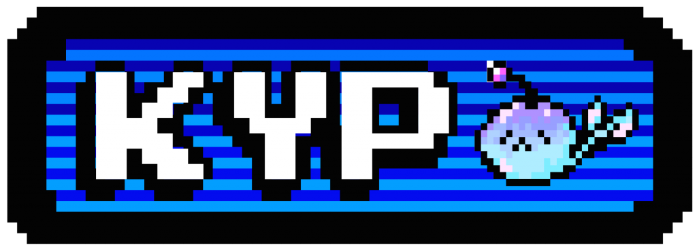
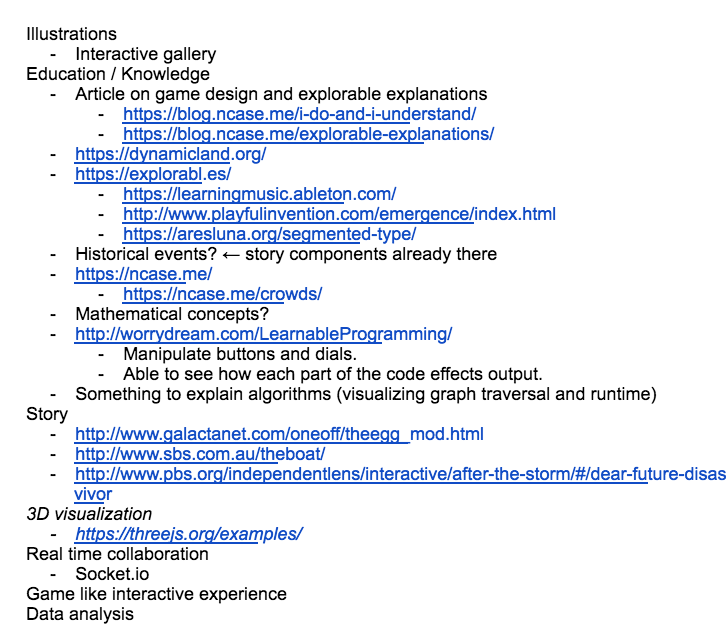
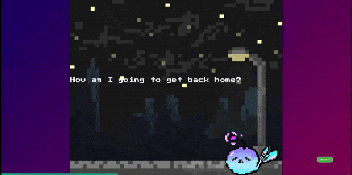
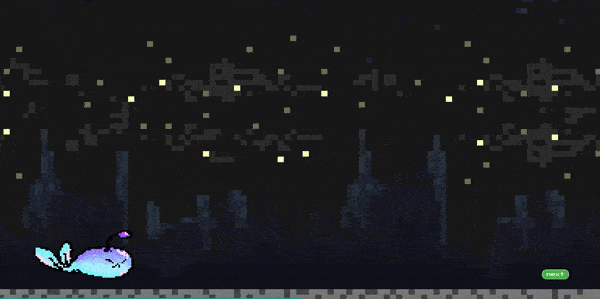
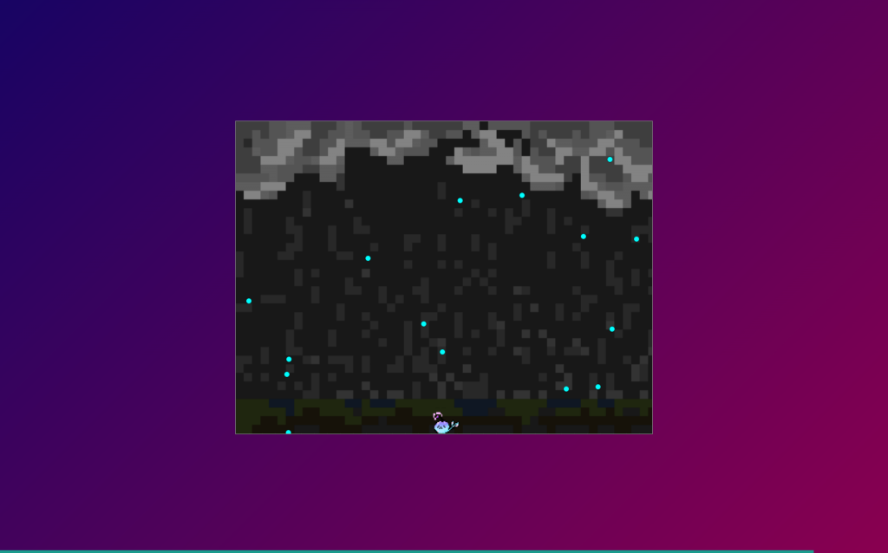
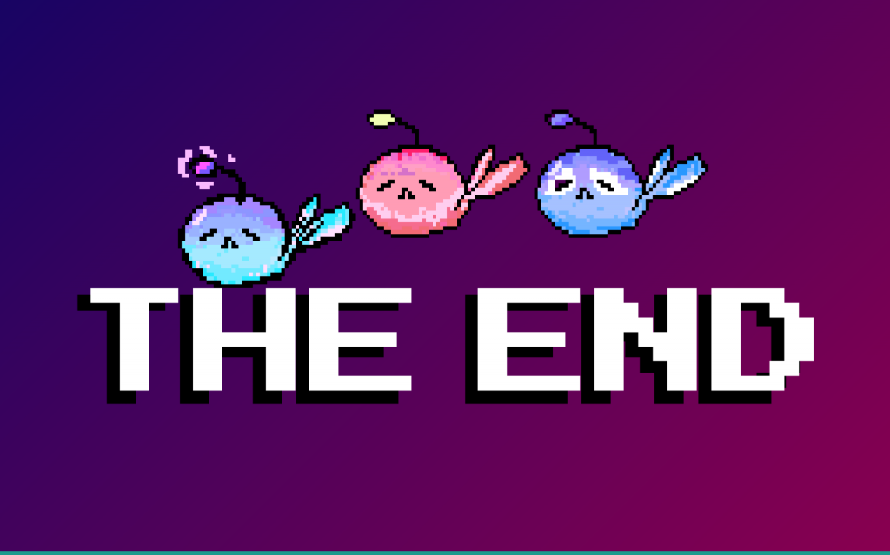

Spent the weekend at [NwHacks](https://www.nwhacks.io/) exploring digital narratives. We were inspired by the work at [NYU's ITP program](https://itp.nyu.edu/ranch/projects/) and by [Nicky Case](https://ncase.me/).

Digital narratives open up a rich landscape of new interactive tools, techniques and possibilities for storytelling. The first challenge was to understand which components we wanted to blend together.

We ultimately chose to blend story, illustrations and game components to design our interactive experience.

**Story design**

Initially, we wanted to do a choose your own adventure story. We all had fond memories of choose your own adventure books as children and knew digital media could take it to the next level.

However, for the purposes of the hackathon, we chose to focus on developing a linear story. The complexity of a choose your own adventure experience would quickly grow and get out of hand. This allowed us to spend more time focusing on the user experience.

The first few ideas we had took place in dystopian settings. We saw the potential to include some interesting gameplay mechanics that blended well with a dystopian themed story. For example, evasion games where the objective is to evade guards to reach some item (money, medicine, etc.). We also saw the potential to include puzzle games for scenes such as breaking out of jail or picking locks.

Our final story focused on a lighter theme. The story follows a young alien child named Kyp who gets lost on Earth and has to find his way back to his parents. Having never been on earth, Kyp must conquer different challenges on his journey to get home. In one scene, Kyp is tasked with crossing a busy highway in a Frogger like game. In another, having never seen rain before, Kyp attempts to dodge raindrops until one finally hits him. At this point, he realizes they are harmless, but cold.

**Building it**

All story assets were designed in Illustrator. The game assets were inspired after a retro 8-bit theme.

We used CSS animations to incorporate moving scenes and bring Kyp to life.

The base of our project was built with React. This allowed us to maintain the progress bar state throughout the story. We were also able to reuse react components for the "pages" of the story that were text only. Turning the page was as simple as rendering the next component.

For the two games, we used HTML Canvas which allowed us to get up and running relatively fast. Since HTML canvas was not specifically built for gaming, we wrote our own collision detection algorithms for both games.

Screenshot from the rain dodge game

**Going further**

I believe there is ample opportunity to use the digital narrative format for education. For one, humans are great at remembering and learning stories. Digital narratives could also provide effective new ways to teach new concepts and ideas. Lessons could take advantage of multiple sensory modalities through the use of video, audio, text, graphics and animation. Connectivity could allow students to communicate and engage in real time collaborative exercises. Feedback on how students are doing for teachers and/or parents could be captured in progress bars, score or student engagement with interactive components. This is an exciting field that I hope to explore further.

Github Repo:

[https://github.com/Siunami/nwhacks2019](https://github.com/Siunami/nwhacks2019)

